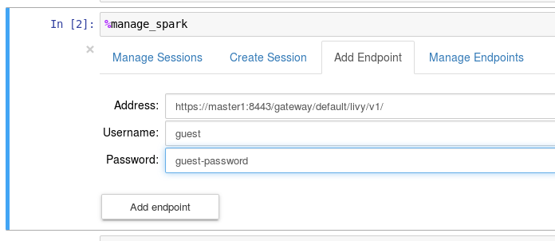
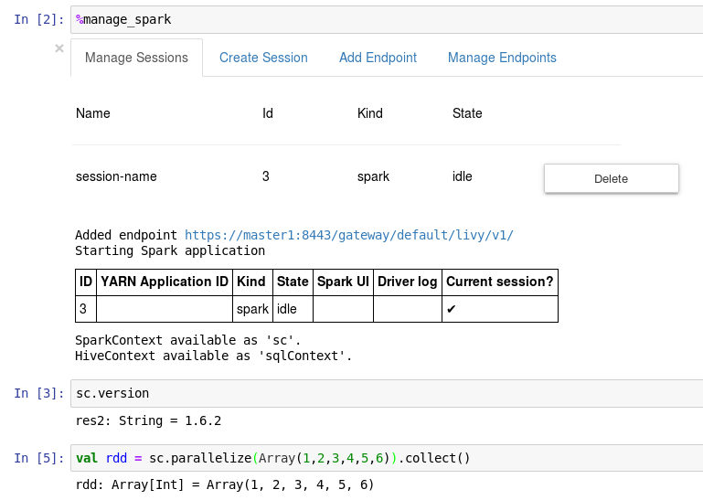

## Configure a new service for Knox


### Service definition

```bash
$ sudo mkdir -p /usr/hdp/current/knox-server/data/services/livy/0.1.0/
$ sudo chown -R knox:knox /usr/hdp/current/knox-server/data/services/livy 
```

- Create a service definition file

	```bash
	$ cat /usr/hdp/current/knox-server/data/services/livy/0.1.0/service.xml
	```

	```xml
	<service role="LIVYSERVER" name="livy" version="0.1.0">
	  <routes>
	    <route path="/livy/v1/sessions">
	        <rewrite apply="LIVYSERVER/livy/addusername/inbound" to="request.body"/>
	    </route>
	    <route path="/livy/v1/**?**"/>
	  </routes>
	</service>
	```


- Create a rewrite rule file

	```bash
	$ cat /usr/hdp/current/knox-server/data/services/livy/0.1.0/rewrite.xml
	```

	```xml
	<rules>
	  <rule name="LIVYSERVER/livy/user-name">
	    <rewrite template="{$username}"/>
	  </rule>
	  <rule dir="IN" name="LIVYSERVER/livy/root/inbound" pattern="*://*:*/**/livy/v1/?{**}">
	    <rewrite template="{$serviceUrl[LIVYSERVER]}"/>
	  </rule>
	  <rule dir="IN" name="LIVYSERVER/livy/path/inbound" pattern="*://*:*/**/livy/v1/{path=**}?{**}">
	    <rewrite template="{$serviceUrl[LIVYSERVER]}/{path=**}?{**}"/>
	  </rule>
	  <filter name="LIVYSERVER/livy/addusername/inbound">
	    <content type="*/json">
	      <apply path="$.proxyUser" rule="LIVYSERVER/livy/user-name"/>
	    </content>
	  </filter>
	</rules>
	```

	Note that the name "livy" attribute and the path .../services/livy/... need to be the same.

	The route /livy/v1/sessions is a special treatment for the POST request to create a Livy session. The request body e.g. looks like:

	```json
	{ 
		"driverMemory":"2G",
		"executorCores":4,
		"executorMemory":"8G",
		"proxyUser":"bernhard",
		"conf":{
			"spark.master":"yarn-cluster",
		  "spark.jars.packages":"com.databricks:spark-csv_2.10:1.5.0"
		}
	}
	```

  Livy server will use proxUser to run the Spark session. To avoid that a user can provide here any user (e.g. a more privileged), Knox will need to rewrite the the json body to replace what so ever is the value of proxyUser is with the username of the authenticated user, see next section.

- Publish new Path via Ambari: Goto Knox Configuration and add at the end of *Advanced Topology*:

	```xml
		<topology>

		...

	        <service>
	            <role>LIVYSERVER</role>
	            <url>http://master1.localdomain:8998</url>
	        </service>
		</topology>
	```

## Start LDAP (optional)

If Knox is not configured with an LDAP server already, start Knox's test LDAP server

```bash
$  /usr/hdp/current/knox-server/bin/ldap.sh start
```

A test user is `guest`with password `uest-password`


## Configure Sparkmagic

If Knox does not have a valid certificate for HTTPS requests, reconfigure [config.json](config.json) end set

```json
 "ignore_ssl_errors": false
```

Then restart Jupyter and open a Spark Notebook.

Again `%load_ext sparkmagic.magics` and `%manage_spark` and now add the Knox Gateqway address and a valid user (Knox will authenticate this user)



The next steps are the same as without Knox:




