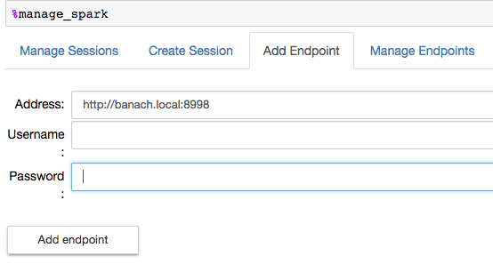
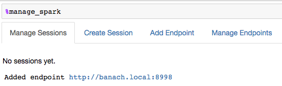
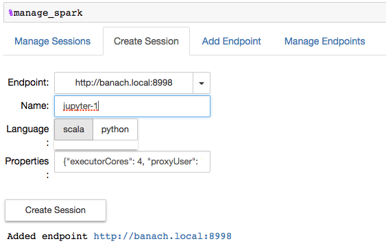
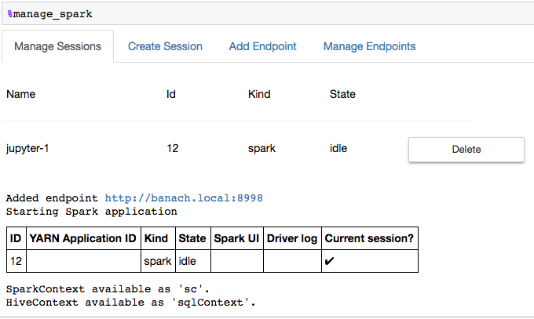

# 1 Configure Ambari

Until [https://github.com/jupyter-incubator/sparkmagic/issues/285](https://github.com/jupyter-incubator/sparkmagic/issues/285) is fixed, set 

	livy.server.csrf_protection.enabled ==> false

in Ambari under Spark Config, livy properties

# 2 Install and Configure Sparkmagic

## 2.1 Install sparkmagic

```bash
$ sudo -H pip install sparkmagic
```

## 2.2 Install Kernels

```bash
$ sudo -H pip show sparkmagic # check path, e.g /usr/local/lib/python2.7/site-packages

$ cd /usr/local/lib/python2.7/site-packages

$ sudo -H jupyter-kernelspec install --user sparkmagic/kernels/sparkkernel
$ sudo -H jupyter-kernelspec install --user sparkmagic/kernels/pysparkkernel

```

## 2.3 Install widgets

```bash
$ sudo -H jupyter nbextension enable --py --sys-prefix widgetsnbextension
```

## 2.4 Install config

Copy [config.json](config.json) to ~/.sparkmagic


# 3 Run Notebooks with Sparkmagic

## 3.1 Start Jupyter Notebooks

In Notebook Home:

```bash
$ cd <project-dir>
$ jupyter notebook
```

and select "New -> Spark"

## 3.2 Load Sparkmagic

In Notebook after Kernel started

```python
%load_ext sparkmagic.magics
%manage_spark
```

## 3.3 Configure Spark Access

### 3.3.1 Select "Add Endpoint"



Result:



### 3.3.2 Create Session

Select "Create Session"



Result:



# 4 Examples

[Sparkmagic for Scala](Sparkmagic-Scala.ipynb)

[Spark in Python Notebook](Spark-in-Python-Notebook.ipynb)
